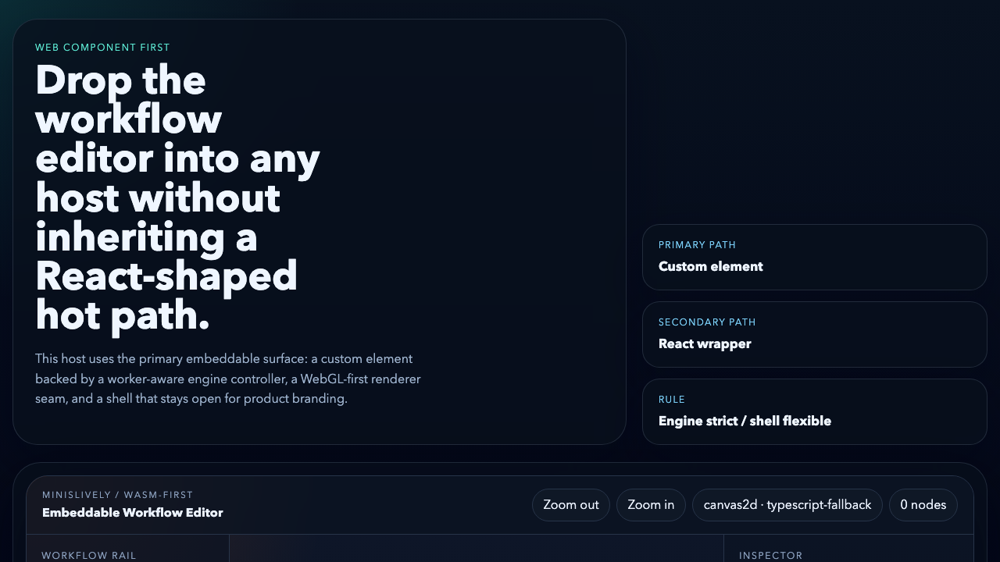
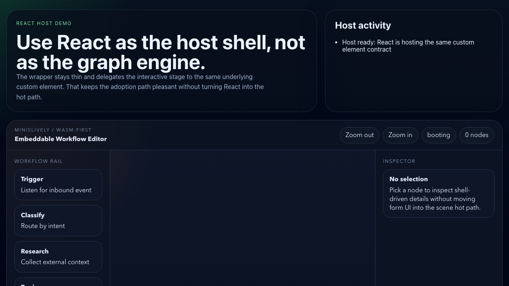

# WASM-First Workflow Editor

Framework-agnostic, embeddable, WASM-first workflow editor monorepo.

[](https://github.com/minislively/wasm-first-workflow-editor/actions/workflows/verify.yml)



## v0 promise

This repository does not promise infinite scale. It promises a measurable baseline:

- `Web Component` is the primary integration path
- `React` stays a secondary host wrapper
- the graph stage stays on an engine-shaped path
- a runnable minimum demo exists from a clean checkout
- benchmark fixtures for `100`, `500`, and `1000` nodes are committed

## Why this exists

Most node editors let shell convenience leak into the graph hot path. This repository does the opposite:

- the graph stage is treated like a scene engine
- the host shell stays open for branding and integration
- the primary adoption path is `Web Component`, not framework lock-in

## What ships in this baseline

- Runnable `Web Component` demo
- Runnable `React` host demo
- Package seams for core, worker runtime, renderers, shell, custom element, and React adapter
- Architecture, adoption, and performance-boundary docs

## Product Demo

Use this surface when you want to understand the editor as a product:

- small default graph
- direct editing feel
- lightweight runtime feedback
- clear `Web Component`-first story

Run it with:

```bash
pnpm demo:web-component
```

## Performance Lab

Use this surface when you want to evaluate runtime behavior:

- explicit `Product Demo / Performance Lab` mode split inside the demo surface
- fixture selector for `basic / 100 / 500 / 1000`
- diagnostics for backend, kernel source, node count, edge count, and zoom
- benchmark-oriented reading of the same editor contract

The lab is intentionally part of the public product surface rather than a hidden dev-only page.

## Demo surfaces

Primary host:


Secondary host:



## Product rule

`Engine is strict, shell is flexible.`

- The graph scene is treated as a rendering engine.
- Product teams are expected to customize shell, inspector, toolbar, theming, and host layout.
- Product teams are not expected to replace the graph hot path with arbitrary DOM-heavy node bodies.

## Quick start

```bash
pnpm install
pnpm bench:fixtures
pnpm typecheck
pnpm test
pnpm wasm:test
pnpm wasm:build
pnpm build
pnpm demo:web-component
```

In another terminal:

```bash
pnpm demo:react
```

If `wasm-pack` is not installed yet, `pnpm wasm:build` will explain how to install it and the rest of the repo still runs on the TypeScript fallback path.

## Integration surfaces

- Primary: `@minislively/workflow-element`
- Secondary: `@minislively/workflow-react`
- Supporting: shared types, engine, renderers, and wasm kernel packages

## Benchmark fixtures

- `basic`: product-oriented default graph
- `100`: light lab fixture
- `500`: medium lab fixture
- `1000`: heavier public baseline fixture

## Package map

- `@minislively/workflow-types`: shared protocol and graph types
- `@minislively/workflow-core`: graph helpers, hit testing, viewport math
- `@minislively/workflow-wasm-core`: TypeScript bridge plus Rust/WASM kernel seam
- `@minislively/workflow-engine-worker`: engine controller for worker and main-thread fallback
- `@minislively/workflow-renderer-webgl`: primary GPU renderer
- `@minislively/workflow-renderer-canvas`: fallback canvas renderer
- `@minislively/workflow-editor-shell`: shell theme tokens and styling contract
- `@minislively/workflow-element`: primary `Web Component` integration surface
- `@minislively/workflow-react`: secondary React wrapper
- `@minislively/workflow-nodepack-basic`: starter graph fixture and node catalog

## Docs

- [Architecture](./docs/architecture/overview.md)
- [Web Component adoption](./docs/adoption/web-component.md)
- [React host guidance](./docs/adoption/react-host.md)
- [Performance boundary](./docs/performance/boundaries.md)
- [Performance baseline](./docs/performance/baselines.md)
- [Contributing](./CONTRIBUTING.md)
- [Release notes](./docs/release/v0.1.0.md)
- [Launch post draft](./docs/release/launch-post.md)

## License

MIT. See [LICENSE](./LICENSE).
